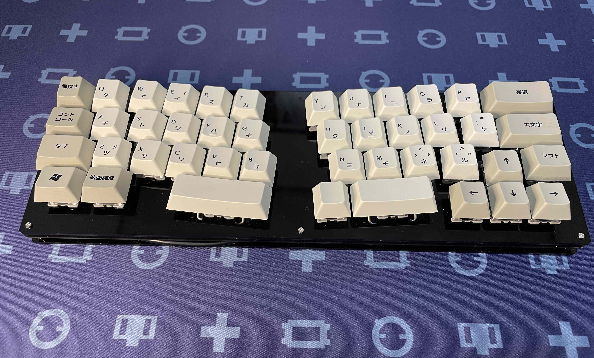

# cool844V2

 
cool844V2は、cool844の改良版を構想する過程で生み出された汎用ケースを使用しない40％アリス配列キーボードです。 
余った汎用ケースを再利用する目的で作った、cool844ですが、汎用ケース自体の背の高さから、パームレスト等が必要となり、不便と感じました。 
cool844で行った40%アリス配列は、使い勝手が良かったので、さらに使いやすく単体で使うことを構想したのが、cool844V2です。 
汎用ケースに収納していたcool844で感じていた高さの問題は、cool844V2でなくなりました。
REMAPによって、自作キーボードにおけるキーレイアウトは簡単に変更できるものとなりました。
これまでもファームウェアを書き換えれば、キーレイアウトの変更は可能であり、市販されているきーボードで感じていた不満を解消できました。
より個人に使いやすく設計されたキーボードとして自作キーボードは残っていくと思います。その一つとして、cool844V2があります。
 
今後、LEDの装着方法の見直し、単体として利用ができて、さらに汎用ケースにも収納できるハイブリッドとしての改良を行います。 
上記までのcool844V2をver.2.0として、汎用ケースでも、アクリル積層密閉型ケースでも使用できるcool844V2がver.2.1です。 
ver.2.1はPCBより下の部分に、ゲタと名付けた部品を介して、汎用ケースに装着できます。気に入った汎用ケースが入手するまでは、標準のアクリル積層密閉型ケースで使用することができます。 
ver.2.0もゲタを使用することで、汎用ケースに装着できます。ただし、USBタイプC基板の取り付けが変更になります。また、汎用ケースを使用しない時に、従来のボトムプレートが使用できないので、切り込みの入った別のボトム方レートを使用します。 
ver2.0用のゲタとボトムプレートも頒布できるように用意します。 
ver.2.1は自分用、最初に用意したものは透明なトッププレートですが、頒布用は黒色となります。ただし、限定ですが、透明なトッププレートも同封した豪華セットも用意します。

 
# ビルドガイド

[こちら](https://github.com/telzo2000/cool844V2/blob/main/buildguide_for_cool844V2.md)になります。 
 

# 今後の予定
20210813 V2(ver.2.0)を頒布しました。 
20210815 V2(ver.2.1)を発注しました。

