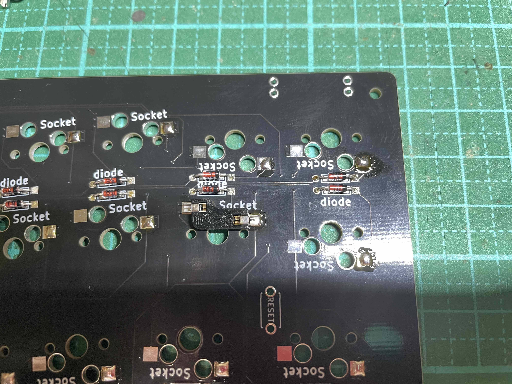
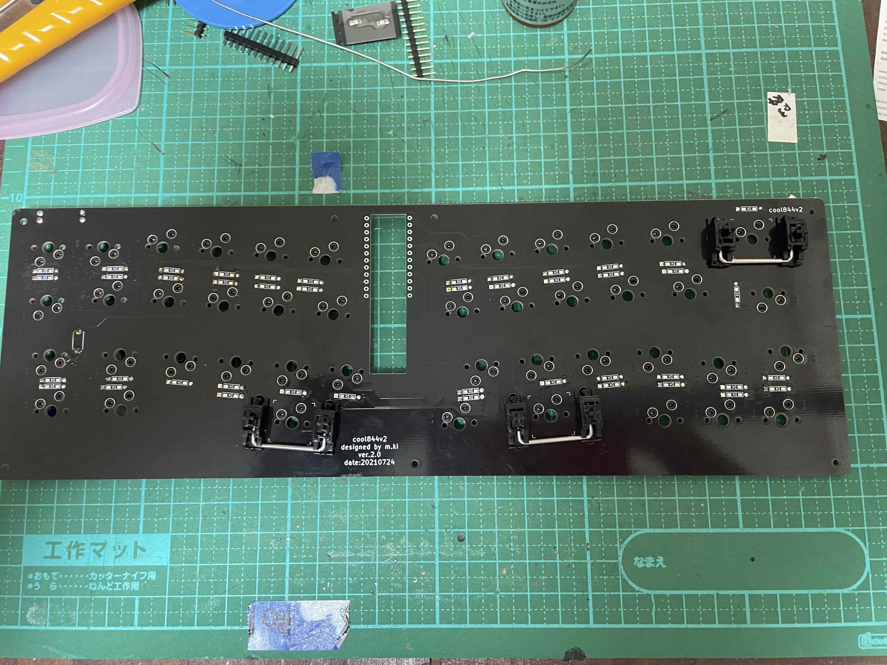
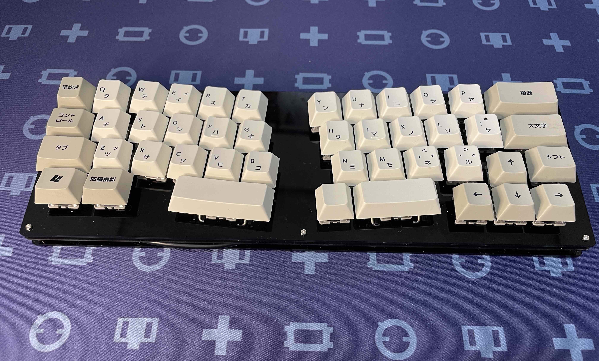

# cool844V2ビルドガイド（ver.2.0対応)

# 0　参考
cool844V2は基本、cool844と同じです。組み立てに困りましたら、cool844の[ビルドガイド](https://github.com/telzo2000/cool844/blob/main/buildguideforcool844.md)を参考にしてください。 
 

# 1　部品の確認
本品はスイッチプレート、PCB、ボトムプレート大、ボトムプレート小（２枚）の他、次のものは各自でご用意ください。 
ダイオード44個、スイッチソケット44個、リセットスイッチ１個、pro micro１個、スプリングピンヘッダ（マックエイトコンスルー）２個、
M2ねじ４mm３本、M2ねじ８mm11本、M2スペーサー３mm７本、M2スペーサー６mm７本、スタビライザー２U ３個、マイクロUSB端子（オス）１個、USBタイプC基板１個、ケーブル60cm程度、
お気に入りのキーキャップセットとなります。 
 
# 2　ダイオードのハンダ付け
PCB基板の下面（基板の右隅に「cool844V2」と印字されている面が上面です）に、「diode」と印字されています。印字されている面から差し込んで、上面からはんだ付けしてください。向きに注意してはんだ付けしてください。 

 

# 3　スイッチソケットのハンダ付け
PCB基板の下面に、「Socket」を印字されています。印字が見えないようにスイッチソケットを乗せて、ハンダ付けをしてください。スイッチソケットには向きがあります。向きを間違えると、キースイッチが入らなくなります。 
正しい向きに乗せた場合

間違った向きに乗せた場合（「Socket」の印字が見えます）

 
# 4　リセットスイッチのハンダ付け
PCB基板の下面に、「RESET」と印字されています。印字が見ねないようにリセットスイッチを乗せて、上面からハンダ付けをしてください。 
 
# ５　pro microのハンダ付け
PCB基板の下面に、スプリングピンヘッダ２個をそれぞれ、差し込んでください。 
スプリングピンヘッダにpro microを差し込んで、pro microとスプリングピンヘッダをハンダ付けをしてください。PCBとスプリングピンヘッダのハンダ付けは不要です。 
 
# ６　ドーターボードの作成
[これ](https://github.com/telzo2000/Hello_keyboard/blob/main/dbforcool844/buildlog.md)を参考にしてください。 
作成したドーターボードは、USB-C端子側をPCBに触れるように置いて、ハンダ付けで固定します。 

マイクロUSB端子は、pro microの端子に装着してください。 
マイクロUSB端子（オス）付きケーブルが同封されている場合、赤色をVBUS、白色をD-、緑色をD+、黒色をGNDにつないでください。 
USBタイプC基板には、GND端子が２箇所ありますが、どちらでも構いません。また、ケーブルの長さは調節して使用してください。 
（追記） 
オプション部品（ゲタ及びボトムプレート改良版）を使用される場合、ドーターボードの取り付ける向きは、USBタイプCが下に来る向きでハンダ付けをしてください。 
その際、PCBとドーターボードの基板との間隔３〜４mmとしてください。
この間隔については、汎用ケースに装着した際、汎用ケースのUCB端子の挿入口に過不足なく、合致するかに関係します。
装着する予定の汎用ケースを持っている場合は、仮合わせをしてからハンダ付けをすることをお勧めします。 
個人の感想ですが、TOFUケースですと、４mmは確実に必要です。 
プラスチックケースですと、３mmぐらいです。 
木製ケースですと、その間で3.5mmぐらいです。 
ドーターボードのUSBタイプCを下向きに固定した場合、従来のボトムプレートでは干渉して装着できません。 
ゲタと一緒に同封されるボトムプレート改良版をしようすれば、スタンドアローンとしてcool844V2が使用できます。 
 
# 7　スタビライザーの装着
PCB基板の上面にスタビライザー2Uサイズを３箇所を装着してください。 

 

# 8 スイッチプレートの装着
PCBにスイッチプレートを装着します。 
M2ねじ8mmをスイッチプレート、M2スペーサー3mm、PCB、M2スペーサー6mmの順でネジ締めを、７箇所行います。 
 
# 9　キースイッチの装着
それぞれのキーソケットに、キースイッチを装着します。装着の際、キースイッチの端子が曲がってしまい、きちんとささらないことがあります。もし、入力できない時は、端子の確認を最初にしてください。それでも改善しないときは、キーソケットのハンダ付けが剥がれていることがあります。 
 
# 10　ボトムプレートの装着
ボトムプレート大を乗せて、手前側３箇所のネジ穴には、M2ねじ４mmでねじ締めします。次に、ボトムプレート小２枚を重ねて、ボトムプレート奥側に置きます。奥側４箇所のねじ穴には、M2ねじ8mmでねじ締めをします。 
この後、任意でゴム足をボト、ボトムプレートの四隅に装着すると、滑りにくくなります。 
 
# 11　キーキャップの装着
お気に入りのキーキャップを装着して完成です。 

 
# 12　ファームウェア
このキーボードはQMKというキーボード用のソフトウェアで動作するようにプログラミングしています。 
[Yoichiro Tanaka@yoichiro](https://twitter.com/yoichiro)さん等が開発した[REMAP](https://remap-keys.app/)が使用できます。
 
pro microとPCをUSBケーブルで繋ぎ、google chromeで[REMAP](https://remap-keys.app/)サイトへアクセスしてください。 

画面中央の「KEYBOARD CATALOG」をクリックしてください。 
画面が変わりましたら、左上の「Keyboard Name」に「cool」と
入力して、下部の「SEARCH」をクリックしてください。
 
coolシリーズのキーボードが表示されます。

この中から、該当するキーボードを選び、クリックしてください。
 
例えば、cool844であれば、次の画面に変わります。
そこでタブの「FIRMWARE」をクリックすると、

このように、via用hexファイルが表示されます。
「FLASH」をクリックすると、

Flash Firmwareが起動して、pro microへの書き込みができます。
 
以上で、pro microへのファームウェアの書き込みは完了です。
 
REMAPのおかげで、自作キーボードのファームウェアの書き込み、キーレイアウトの変更が大変、簡単になりました。
 
 
